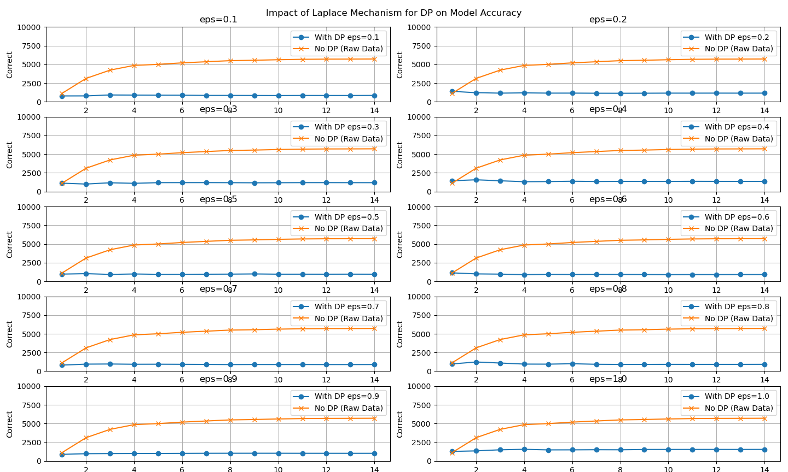

# 7/9 研究ミーティング

## 課題

- PyTorchの画像分類についての深層学習[テストセット](https://github.com/pytorch/examples/blob/main/mnist/main.py)を理解し、DPを実装して、結果をグラフに描写

## DPの実装

- ローカルデータをサーバ（`device`）に送らず、学習結果の勾配のみサーバに送る
- サーバがもつグローバルモデルをローカルにコピーして学習し、勾配を算出する
- 勾配にノイズを加えてサーバに送る

### トレーニングメソッド

#### グローバルモデルを使用せず、ローカルモデルを作成しコピーする

```python
    local_model = Net(model.privacy_params)
    local_model.load_state_dict(model.state_dict())
    local_model.train()
```

#### データをサーバに送信せず、ローカルモデルを使用する

```python
    for batch_idx, (data, target) in enumerate(train_loader):
        # data, target = data.to(device), target.to(device)
        optimizer.zero_grad()
        output: torch.Tensor = local_model(data)
        loss: torch.Tensor = F.nll_loss(output, target)
```

#### ローカルモデルから勾配を計算し、勾配にノイズを加える

```python
        loss.backward()
        # 計算された勾配を保存
        grads: list[torch.Tensor] = [
            param.grad.clone()
            for param in local_model.parameters()
            if param.grad is not None
        ]

        noised_grads: list[torch.Tensor] = []
        privacy_params: PrivacyParams = model.privacy_params

        for grad in grads:
            noise: torch.Tensor = torch.distributions.Laplace(
                privacy_params.mean, privacy_params.var
            ).sample(grad.shape)
            noised_grads.append(grad + noise)

        for param, grad in zip(model.parameters(), noised_grads):
            param.grad = grad.to(device)
        
        optimizer.step()
```

- `local_model`のパラメータのうち、勾配`grad`を配列`grads`に入れる
- Laplaceメカニズムを利用し、ノイズを追加して配列`noised_grads`に入れる
- グローバルモデルのパラメータをノイズを加えた勾配を元に更新
  
ここで、`privacy_params`は以下

```python
class PrivacyParams:
    def __init__(self, eps: float = 0.5, sensitivity: float = 1.0, mean: float = 0):
        self.eps: float = eps
        self.sensitivity: float = sensitivity
        self.mean: float = mean
        self.var: float = self.sensitivity / self.eps
```

```python
eps_values: list[float] = [0.1 * i for i in range(1, 11)]
for eps in eps_values:
        privacy_params = PrivacyParams(eps=eps, sensitivity=1.0, mean=0)
        ...
```

## 結果

`Accuracy`の数で比較した。

### 異なる$\epsilon$間での差


- 大きい方がよく学習できる

### DPなしとDPあり




- DPがあるとほとんど学習できていない
- $\epsilon$が大きいほど学習できる

### ラプラスメカニズムのスケーリング

- `noise`を$\sqrt(m)$で割った

```python
noise: torch.Tensor = torch.distributions.Laplace(
                    privacy_params.mean, privacy_params.var
                ).sample(grad.shape) / math.sqrt(len(grads))
```


- スケーリング有無の比較

