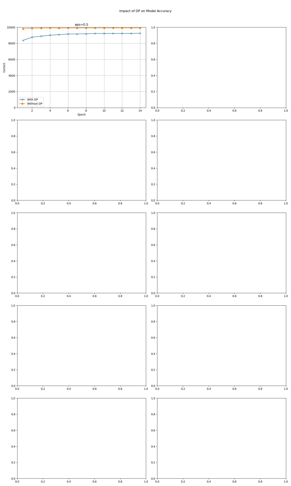

# 7/18 研究ミーティング

## 7/9課題について

### FB

- 変えるのは以下の部分

```python
loss: torch.Tensor = F.nll_loss(output, target)
loss.backward()
```

- `main.py`のaccuracyはほとんど100%なので何か違うのではないか
- `noise`が大きい割にaccuracyが小さすぎる

### なぜ間違えたか

- 連合学習と差分プライバシーはセットだと勘違いしていた
- `--dry-run`をすると全く学習しないものだった
- 正しい`main.py`の結果は以下

```plaintext
[9821, 9871, 9887, 9900, 9899, 9906, 9907, 9912, 9906, 9919, 9916, 9914, 9918, 9917]
```

## 課題

1. 正しいDP-SGDの実装
   - opacusを用いない
   - opacusを用いる
   - privacy budgetを考える
2. ２つの論文を読む
   - https://arxiv.org/abs/2306.01684
   - https://arxiv.org/abs/2406.19008

## 課題1

### Opacusを用いない

#### クリッピング

```py
def clip_gradients(grads, clipping_norm=1.0) -> list[torch.Tensor]:
    clipped_grads: list[torch.Tensor] = []
    for grad in grads:
        param_norm: torch.Tensor = grad.norm(2)
        clip_coef: torch.Tensor = clipping_norm / (param_norm + 1e-6)
        if clip_coef < 1:
            grad: torch.Tensor = grad.clone() * clip_coef.to(grad.device)
        clipped_grads.append(grad)
    return clipped_grads
```

```py
clipped_grads_per_data: list[list[torch.Tensor]] = [
            clip_gradients(grads) for grads in grads_per_data
        ]
```

```py
clipped_grads_per_data = [
    [grad_1_data1, grad_2_data1, grad_3_data1, ..., grad8_data1],  # データポイント1の勾配
    [grad_1_data2, grad_2_data2, grad_3_data2, ..., grad8_data1],  # データポイント2の勾配
    ...
]
```

#### 平均化

```py
avg_grads: list[torch.Tensor] = [
            torch.mean(
                torch.stack([grads[i] for grads in clipped_grads_per_data]), dim=0
            )
            for i in range(len(clipped_grads_per_data[0]))
        ]
```

#### ノイズの追加

```py
def add_laplace_noise(model, grads) -> list[torch.Tensor]:
    privacy_params: PrivacyParams = model.privacy_params
    noised_grads: list[torch.Tensor] = []
    for grad in grads:
        noise: torch.Tensor = torch.distributions.Laplace(
            privacy_params.mean, privacy_params.var
        ).sample(grad.shape)
        noised_grads.append(grad + (noise / math.sqrt(len(grads))).to(grad.device))
    return noised_grads
```

```py
 noised_grads: list[torch.Tensor] = add_laplace_noise(model, avg_grads)
```

#### 勾配の適用

```py
for param, noised_grad in zip(model.parameters(), noised_grads):
            if param.grad is not None:
                param.grad.data.copy_(noised_grad) 
```


→Accuracyが低すぎる！

松本さんに尋ねたところ、ノイズが異なるとのことだったので、以下に変更

```py
class PrivacyParams:
    def __init__(
        self, eps: float = 0.5, delta: float = 0.0001, mean: float = 0
    ) -> None:
        self.eps: float = eps
        self.delta: float = delta
        self.mean: float = mean
        self.std: float = math.sqrt(2 * math.log(1.25 / self.delta)) / self.eps
```

```py
noise: torch.Tensor = torch.randn(grad.shape) * privacy_params.std + privacy_params.mean
        noised_grads.append(grad + noise.to(grad.device))
```

$\epsilon = 0.01 \sim 0.1$に変化させた結果

ここで、$\delta = 0.0001$


松本さんに
> もっとノイズがのるはず  
> $\delta$の値は、データ数の逆数ぐらいが目安

とご指摘をいただいた

[元論文](https://arxiv.org/abs/1607.00133)を参考にし、$\delta = 0.00001$にして実験したがうまくいかない

→そもそもノイズののせ方が異なっていた

高橋さんからのアドバイスを受け、以下のような結果になった



いい感じっぽい

### privacy budgetについて

一つのデータセットから、異なるミニバッチをランダムに取り出して学習している

しかし、データポイントの重複の可能性はある

よってプライバシー合成は、データポイントの重複部分は直列合成し、最終的にデータポイント全体で並列合成

最悪の場合、$T$回の処理で$T * \epsilon$

## 課題2

### Harnessing LLM to generate private synthetic text

- 事前にpublicly trainedされたLLMに対して、sensitive dataを使ってfine tuningする
  - 損失関数として**Prefix-LM**が良い
    - inputに重みをつけないからinputに直接sensitive dataを持って来れる
    - outputはDP
  - チューニング方法として**LoRA tuning**が良い
    - 訓練可能な重みがPrompt tuningよりは多く、full fine-tuningよりは少ない
- このfine-tuned LLMから自己回帰的にサンプリングし、合成データを作る

### VertiMRF: Differentially Private Vertical Federated Data Synthesis

- MRF(マルコフランダムフィールド)を用いる
- Party $P_i$で
  - $MRF_i$を作り、属性グラフ$G_i$, 周辺集合$S_i$を保持
  - DPなFMスケッチで主成分保持しながら次元削減、このコードを$M_i$
  - $MRF_i, G_i, S_i, M_i$をサーバに送る
- サーバで
  - partyから受信した$G_i$を組み合わせてグローバル属性グラフ$G$を作成し、三角化
    - ＄M_i$から推定されるRスコアが高いものをリンク
  - 受信ごとに$MRF$のパラメータ$\Theta$を改善